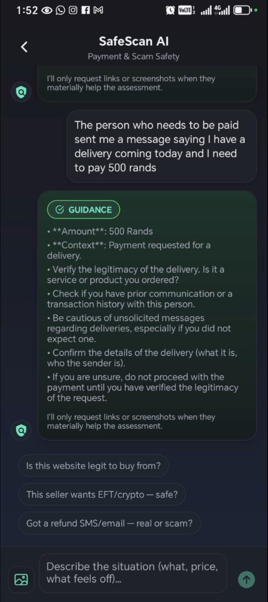
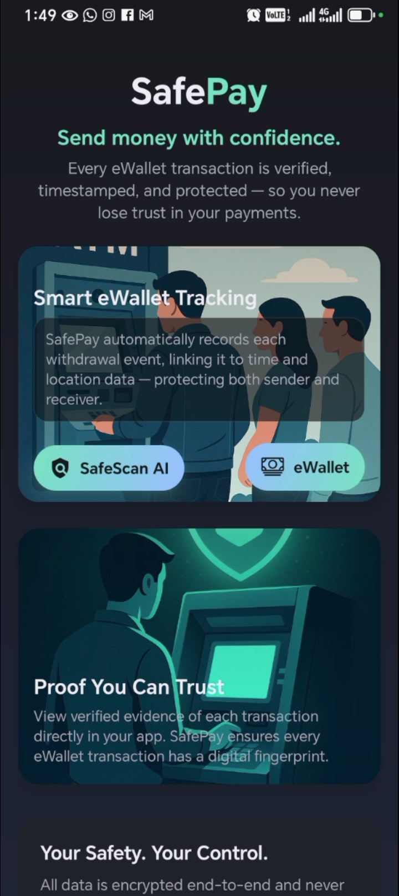

# SafePay

**SafePay** is an AI-powered fraud-awareness chatbot app designed to help users verify transactions, detect possible scams, and learn how to stay safe from digital fraud before sending money.

The app was built to solve a real problem: many people lose money because they are unsure whether a payment request, eWallet withdrawal, account number, or transaction source can be trusted. SafePay aims to give users a simple way to pause, ask questions, and get guidance before making a risky decision.

## Why This App Was Built

Fraud and scam attempts are becoming more common, especially in digital payments and person-to-person transfers. Many users are pressured to act quickly, often without enough knowledge to verify whether a transaction is legitimate.

SafePay was created to help with that challenge by focusing on three things:

- **Transaction awareness** – helping users think twice before paying
- **Scam detection support** – identifying suspicious patterns and warning signs
- **Fraud education** – teaching users how to verify payment requests and protect themselves

This project also served as a personal technical challenge: building an app that uses AI in a practical, real-world way to guide users with helpful, understandable responses.

## What SafePay Does

SafePay helps users:

- check whether a transaction or payment request looks suspicious
- identify common scam patterns and red flags
- get AI-based guidance before sending money
- learn safe verification habits
- improve awareness around fraud, eWallet risks, and online payment scams

Rather than only acting as a chatbot, the goal of SafePay is to become a smart fraud-awareness assistant that helps users make safer payment decisions.

## Project Direction

The original idea for SafePay was broader than a chatbot. The vision included stronger proof and verification features, including deeper transaction confirmation workflows.

However, some advanced ideas raised legal and compliance concerns, especially around using CCTV-related evidence to help prove whether a withdrawal or transaction actually took place. Because of those concerns, the project direction was narrowed to focus on the **AI chatbot experience**, education, and scam detection guidance.

That decision helped keep the project practical, responsible, and focused on the feature that could still provide strong value to users.

## Technical Challenge

One of the most interesting parts of building SafePay was exploring how AI can be used in a way that is actually useful, not just impressive.

The aim was to build an assistant that could:

- respond clearly to fraud-related questions
- guide users in a safe and understandable way
- explain why something may be risky
- encourage better decision-making instead of blind trust

This project reflects a strong interest in combining **AI, mobile development, and real-world problem solving**.

## Tech Stack

SafePay was built using technologies focused on mobile app development and AI integration:

- **React Native**
- **Expo**
- **JavaScript**
- **Firebase**
- **Firebase Functions**
- **OpenAI API**

## Key Features

- AI-powered chatbot interface
- fraud-awareness guidance
- transaction safety support
- scam warning education
- mobile-first user experience
- Firebase-backed app structure

## Current Status

SafePay is still a developing project and not yet fully complete. The chatbot and fraud-awareness direction form the current core of the app, while broader verification features remain limited by legal and compliance considerations.

Even in its current state, the project shows:

- practical AI integration
- clear product thinking
- user-safety focused design
- willingness to solve meaningful real-world problems

## Demo

**YouTube Demo:**  
[Paste your YouTube link here]

## Screenshots

## What This Project Shows

SafePay demonstrates the ability to:

- build a real mobile application from idea to implementation
- integrate AI into a practical use case
- think critically about fraud, trust, and digital safety
- adapt a product idea when legal or compliance limits appear
- create software with both technical and social value

## Future Improvements

Possible future improvements include:

- stronger verification workflows
- improved fraud pattern analysis
- better transaction history and case handling
- safer reporting features
- more advanced AI guidance and conversation flows
- compliance-friendly ways to strengthen proof and dispute support

## Author

**Ntsika Nteya**
